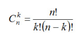

# Мы подбрасываем монету три раза. Нужно найти вероятность того, что орёл выпадет ровно два раза.

### Определяем количество всех вариантов подбрасываний, это 2 в степени 3 (т.к исхода 2, а подбрасываем 3 раза). ###

    Выходит 8 допустимых вариантов.

### Определяем количество подходящих нам вариантов по формуле сочетаний: ###

 
 где n - количество всех подбросов, а k - количество исходов подброса
 
В результате вычисления получаем 3 варианта.

### И расчитываем вероятность количество подходящих вариантов делим на общее количество. ###

## ОТВЕТ: 3/8 ## 
